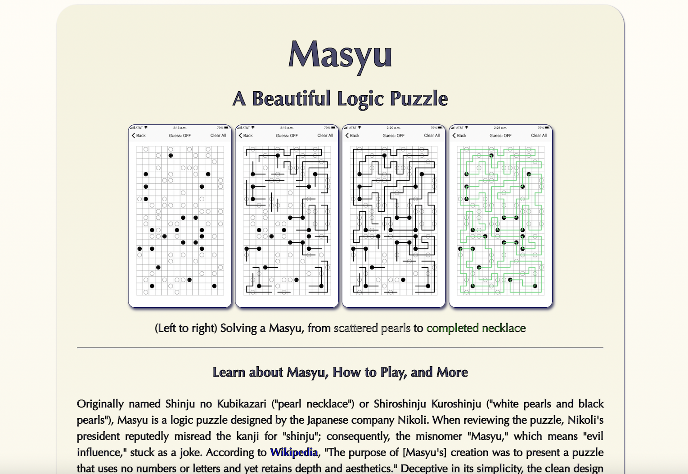

# Masyu Application

**_View this project:_** [https://fluffy-muffin-9a935d.netlify.app/](https://fluffy-muffin-9a935d.netlify.app/)

## Description

A minimally altered, responsive version of my Masyu app for display on my responsive coding portfolio website. The application is an interactive landing page for Masyu puzzles, built with HTML, CSS, and JavaScript. Click the button at the bottom to sign up for the fictional Masyu Daily Challenge!

Submitted as my final student project for SheCodes Basics coding workshop, this application was coded in my third week of learning how to code, with zero prior knowledge!

## Coding Features

- Well-organized HTML
- HTML elements: h1, h2, h3, h4, h5, p, ul, li, a, img, button, div, span, hr, br, strong, em, title, style, script
- HTML attributes: class, href, target, title, src, alt

---

- Well-organized CSS rule sets
- CSS properties: background (with linear gradient), border, border-radius, box-shadow, color, cursor, display, font-family, font-weight, font-size, line-height, margin, max-width, min-width, min-height padding, text-align, text-decoration, width
- CSS class selectors
- CSS pseudo-selector (hover)
- Fully responsive styling for devices of all sizes

---

- Interactive sign-up button programmed with JavaScript, with a secret surprise footer using the .innerHTML method, along with data entered by the user, and appearing after the completion of sign-up steps
- JavaScript function, variables, conditional statement (if/else), query selector, event listener with click event, prompt, alert, string concatenation, .innerHTML() method, .toUpperCase() method, .trim() method, identity operator, logical operators (and emojis!)
- Global and block scope
- Clear, descriptive names
- Debugging with console.log() method

---

- Accessibility rating by Lighthouse audit: 100/100 for desktop and 100/100 for mobile devices
- Coded in VS Code with hosting on Netlify
- Includes this polished README using Markdown

## Content & Design Features

- All text is original and written by me

- All images are original screenshots that illustrate the solving of the puzzle by me

- Original design with a card-like appearance, tasteful font (with a fallback font), and complementary, reversed color gradients for the background of the web page and the inset application. Wedding of form and content: the minimalist aesthetic of the app complements the minimalist aesthetic principles of the puzzles.

- Sign-up newsletter function accepts a range of inputs from the user across the spectrum of enthusiasm, including the inputs "yes," "yeah," "sure," "yep," "definitely," "totally," "hell yes," and "hell yeah," accounting for blank space (with the .trim() method) and for uppercase or lowercase letters

- Fully-functioning links to resources to get started solving Masyu puzzles today!

## Preview

## Attributions

**_For comparison:_** Design inspired by the SheCodes Basics demo:[https://www.shecodes.io/demos/project](https://www.shecodes.io/demos/project)
